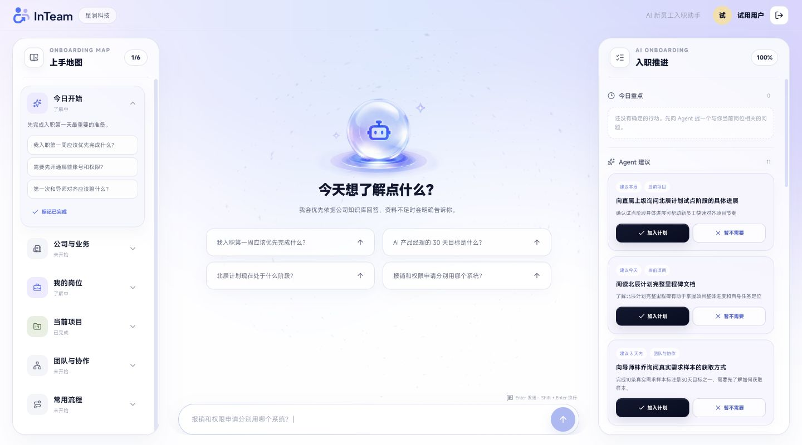

# InTeam

面向企业内部场景的 AI 新员工入职助手。InTeam 将企业知识问答、六主题上手地图和可确认的行动计划放在同一个工作台中，帮助新员工从“提出问题”走向“完成下一步”。

## 核心能力

- 六主题上手地图：今日开始、公司与业务、我的岗位、当前项目、团队与协作、常用流程。
- 企业知识问答：基于 Dify Chatflow 检索企业资料，支持多轮与流式输出。
- 过程状态反馈：理解问题、检索知识、组织回答等阶段持续可见。
- 候选行动：Agent 生成建议，用户确认后才加入个人计划。
- 入职推进：今日重点、Agent 建议、我的行动和完成进度联动。
- 回答反馈：支持“有帮助”和“没解决”，用于知识与工作流优化。
- 响应式界面：桌面三栏、移动端单栏三入口。

## 产品流程

~~~text
上手地图或主动提问
        ↓
企业知识检索与流式回答
        ↓
追问建议与候选行动
        ↓
用户确认加入计划
        ↓
行动完成与主题进度联动
~~~

## 技术栈

| 层级 | 技术 |
|---|---|
| 前端 | Next.js 16、React 19、TypeScript、TanStack Query |
| 后端 | FastAPI、SQLAlchemy、Alembic、SSE |
| AI 与 RAG | Dify Chatflow、知识检索、结构化输出 |
| 数据 | SQLite；生产环境可替换数据库或配置对象存储备份 |
| 测试 | Pytest、Vitest、Playwright |

## 项目结构

~~~text
InTeam/
├── backend/       FastAPI API、业务服务、数据模型、迁移和测试
├── frontend/      Next.js 工作台、响应式交互和前端测试
├── dify/          Chatflow DSL、提示词、契约、示例知识和 RAG Case
├── docs/          当前 PRD 与产品截图
├── .env.example  配置模板
└── LICENSE        项目开源许可证
~~~

## 本地运行

### 1. 启动后端

需要 Python 3.11。

~~~bash
cd backend
python3.11 -m venv .venv
.venv/bin/pip install -r requirements-dev.txt
cp .env.example .env
~~~

在 backend/.env 中至少设置两个本地会话参数：

~~~dotenv
SESSION_SECRET=请填写至少32字符的随机值
INVITE_PEPPER=请填写另一段至少32字符的随机值
~~~

使用 Dify 作为问答服务时继续设置：

~~~dotenv
CHAT_PROVIDER=dify
DIFY_BASE_URL=https://api.dify.ai/v1
DIFY_APP_API_KEY=请填写你的Dify应用APIKey
~~~

初始化数据库并生成一个本地体验入口：

~~~bash
.venv/bin/alembic upgrade head
.venv/bin/python cli_invite.py generate --count 1 --note "local development"
.venv/bin/uvicorn app.main:app --host 127.0.0.1 --port 8000
~~~

当前代码中的邀请码入口用于演示和本地体验。企业部署时可以按照组织要求替换为 SSO、飞书 OAuth 或企业现有身份系统。

### 2. 启动前端

需要 Node.js 20.9 或更高版本。

~~~bash
cd frontend
npm ci
npm run dev
~~~

浏览器打开 http://localhost:3000。

前端默认将 /api/v1 请求转发到 http://127.0.0.1:8000。需要连接其他后端地址时，在 frontend/.env.local 中设置：

~~~dotenv
BACKEND_URL=http://127.0.0.1:8000
~~~

## 配置 Dify

1. 在 Dify 中创建或导入 Chatflow。
2. 创建公司通识、岗位与协作、项目知识三个知识库。
3. 将 dify/knowledge-source 中的示例资料替换为企业自己的资料。
4. 在导入的 Chatflow 中重新绑定知识库和模型。
5. 发布 Chatflow，并把应用 API Key 写入后端环境变量。

公开 DSL 位于 dify/exports/InTeam-Onboarding-Agent-v1.6-published.yml。出于安全和可移植性考虑，仓库中的知识库 ID 已清空，导入后必须重新绑定。

知识数据、工作流、模型、检索配置和企业接入方式均应根据企业要求定制。

## MiSans 字体

MiSans 字体文件未包含在仓库中。小米官方许可允许在应用中使用 MiSans，但禁止单独重新分发字体软件。

如需恢复设计稿中的 MiSans 效果：

1. 从 [MiSans 官方页面](https://hyperos.mi.com/font) 下载字体并阅读许可协议。
2. 将可变字体文件放到 frontend/public/fonts/MiSans-VF.ttf。
3. 保留软件中使用 MiSans 的说明。

未安装字体时，界面会回退到系统无衬线字体。

## 测试

后端：

~~~bash
cd backend
.venv/bin/python -m pytest tests -q
~~~

前端：

~~~bash
cd frontend
npm run lint
npm run typecheck
npm test
npm run build
~~~

## 安全说明

- 不要提交任何 .env、API Key、Cookie、数据库、备份或运行日志。
- Dify API Key、对象存储密钥和企业系统凭证只保存在服务端。
- 发布到生产环境前，应更换会话密钥、配置允许域名、开启安全防护并完成真实 RAG 回归测试。
- 示例知识仅用于展示数据结构和工作流，部署时应替换并按企业权限要求管理。

## 文档

- [产品需求文档 v1.8](docs/InTeam-PRD-v1.8.md)
- [Dify 资产说明](dify/README.md)
- [Dify Chatflow 说明](dify/chatflow/README.md)
- [Dify 知识库配置](dify/Dify知识库配置与导入说明.md)

## 许可证

项目自有代码采用 [MIT License](LICENSE)。

React Bits 衍生组件使用 MIT + Commons Clause，详见 [第三方声明](THIRD_PARTY_NOTICES.md)。MiSans 字体不随仓库分发，使用者需自行从官方渠道下载并遵守其许可。
