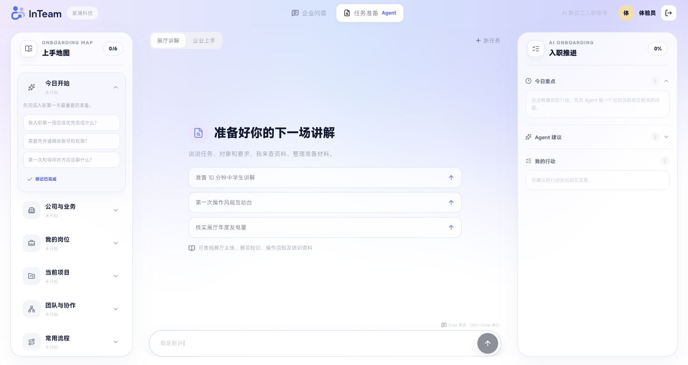
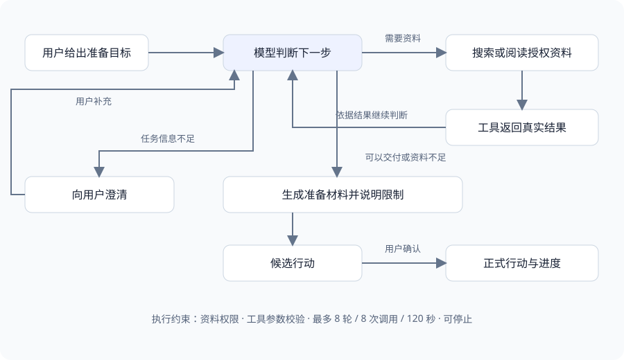
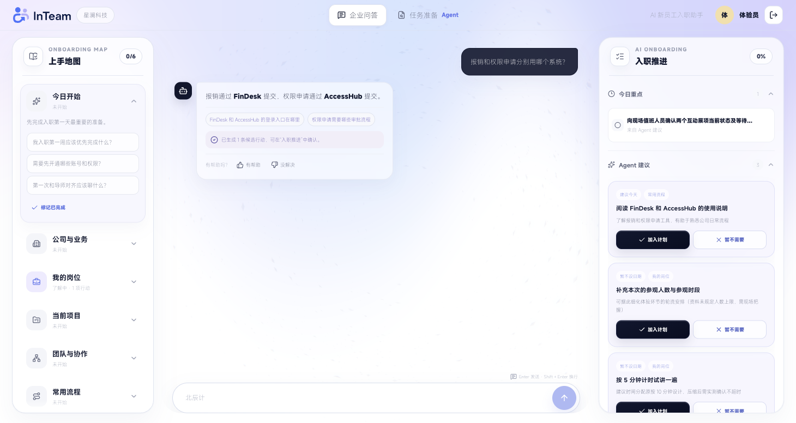

# InTeam

**企业知识助手与任务准备 Agent**，面向员工上手和展厅知识交付。既可以基于企业资料回答问题，也可以接收一个准备目标，自主搜索、阅读和补查资料，整理出可继续修改的准备材料。

[](https://github.com/FengLi-AI/InTeam/actions/workflows/ci.yml)

[在线体验（需邀请码）](https://sfvkljsfbadvdk8ub5h00.apigateway-cn-beijing.volceapi.com/) · [v1.9 能力说明与验证记录](docs/agent-release-v1.9.md)



## 两种使用方式

| 模式 | 你可以这样问 | InTeam 做什么 |
|---|---|---|
| 企业问答 | “报销和权限申请分别用哪个系统？” | 通过 Dify RAG（检索企业资料后回答）查找依据，提供回答、追问和候选行动。 |
| 任务准备 Agent | “为中学生准备 5 分钟能源展厅讲解，附操作注意事项。” | 模型自主决定搜索、阅读全文或补查，整理讲解材料、资料依据及待核实事项。 |
| 任务准备 Agent | “整理 AI 产品经理入职第一周的准备清单。” | 从岗位、流程和项目资料中整理准备材料，并支持继续追加要求。 |

两种模式共用上手地图和行动计划。建议先保留为候选，用户确认后才加入正式行动。

## Agent 如何运行

任务准备使用后端 **Agent Loop（模型根据工具结果决定下一步的循环）**。模型可以调用 `search_knowledge`（搜索资料）和 `read_document`（阅读资料），再根据真实结果决定继续查询、向用户澄清，或生成准备材料。



企业问答仍使用 Dify Chatflow。两个模式有各自的执行流程，任务准备的工具循环由 FastAPI 后端管理。

**Agent Harness（支撑模型执行任务的程序机制）**包括：

- **工具与权限控制**：只开放搜索、阅读工具，校验参数与用户资料权限。
- **执行预算**：默认最多 8 轮、8 次工具调用、120 秒，支持用户中途停止。
- **过程与历史**：查看资料查询过程、参考资料和任务记录，支持连续修改目标。
- **依据校验**：校验引用的资料是否实际查询过；区分资料不足、任务信息待补充和现场待确认。
- **人工确认**：模型输出准备材料与候选行动，正式行动由用户确认后写入。

当前支持企业上手和展厅讲解两个场景。Agent 不会操作展厅设备、发送消息或修改企业业务系统；项目最新进展、设备实际状态等仍需相应系统或人员确认。

## 工作台能力

- 六主题上手地图：今日开始、公司与业务、我的岗位、当前项目、团队与协作、常用流程。
- 企业知识问答：支持多轮对话、流式回答与回答反馈。
- 任务准备：支持场景切换、补充要求、停止、历史记录和准备材料复制。
- 入职推进：今日重点、候选建议、我的行动和完成进度联动。
- 响应式界面：标题栏切换两种模式；共用自适应输入框；桌面三栏、移动端单栏三入口。

<details>
<summary>查看企业问答界面</summary>



</details>

## 已完成的验证

截至 2026-09-19：后端 202 项测试、前端 30 项测试通过，Lint、类型检查和生产构建通过。完成 60 道真实问答及回答规则调整后的 15 道重点复测，并验证线上登录、Agent、行动确认、停止任务和用户隔离。

测试结果说明已验证的范围，不代表任意问题都能正确回答。详细问题、修复与验收记录见 [v1.9 报告](docs/agent-release-v1.9.md)。

## 技术栈

| 层级 | 技术 |
|---|---|
| 前端 | Next.js 16、React 19、TypeScript、TanStack Query |
| 后端 | FastAPI、SQLAlchemy、Alembic、SSE |
| 任务准备 Agent | 后端 Agent Loop、模型工具调用、资料权限与执行预算 |
| 企业问答与 RAG | Dify Chatflow、混合检索、结构化输出 |
| 数据 | SQLite、任务历史、生产环境对象存储备份 |
| 测试 | Pytest、Vitest；仓库另含 Playwright 测试配置 |

## 项目结构

~~~text
InTeam/
├── backend/
│   ├── app/services/agent/          Agent Loop、模型、工具与任务存储
│   ├── data/agent-knowledge/        展厅资料与部署时生成的企业资料包
│   └── ...                         API、业务服务、数据模型、迁移和测试
├── frontend/                       问答与任务准备工作台、响应式交互
├── dify/                           企业知识、Chatflow、提示词和 RAG 评测集
├── docs/                           产品文档、迭代报告与截图
├── .env.example                    配置模板
└── LICENSE                         项目开源许可证
~~~

## 本地运行

### 1. 启动后端

需要 Python 3.11。

~~~bash
cd backend
python3.11 -m venv .venv
.venv/bin/pip install -r requirements-dev.txt
cp .env.example .env
~~~

在 backend/.env 中至少设置两个本地会话参数：

~~~dotenv
SESSION_SECRET=请填写至少32字符的随机值
INVITE_PEPPER=请填写另一段至少32字符的随机值
~~~

使用 Dify 作为问答服务时继续设置：

~~~dotenv
CHAT_PROVIDER=dify
DIFY_BASE_URL=https://api.dify.ai/v1
DIFY_APP_API_KEY=请填写你的Dify应用APIKey
~~~

初始化数据库并生成一个本地体验入口：

~~~bash
.venv/bin/python migrate.py upgrade head
.venv/bin/python cli_invite.py generate --count 1 --note "local development"
.venv/bin/uvicorn app.main:app --host 127.0.0.1 --port 8000
~~~

当前版本采用邀请码登录。企业部署可按组织要求接入 SSO、飞书 OAuth 或企业现有身份系统；这些接入需要另外配置和验证。

### 2. 启动前端

需要 Node.js 20.9 或更高版本。

~~~bash
cd frontend
npm ci
npm run dev
~~~

浏览器打开 http://localhost:3000。

前端默认将 /api/v1 请求转发到 http://127.0.0.1:8000。需要连接其他后端地址时，在 frontend/.env.local 中设置：

~~~dotenv
BACKEND_URL=http://127.0.0.1:8000
~~~

## 配置 Dify

1. 在 Dify 中创建或导入 Chatflow。
2. 创建公司通识、岗位与协作、项目知识三个知识库。
3. 按企业实际情况维护 `dify/knowledge-source` 中的资料。
4. 在导入的 Chatflow 中重新绑定知识库和模型。
5. 发布 Chatflow，并把应用 API Key 写入后端环境变量。

公开 DSL 位于 [v1.9 工作流导出](dify/exports/InTeam-Onboarding-Agent-v1.9-published.yml)。其中知识库与模型的关联依赖原工作区，导入后必须按自己的环境重新绑定；API Key 在服务端单独配置。

知识数据、工作流、模型、检索配置和企业接入方式均应根据企业要求定制。

## MiSans 字体

MiSans 字体文件未包含在仓库中。小米官方许可允许在应用中使用 MiSans，但禁止单独重新分发字体软件。

如需恢复设计稿中的 MiSans 效果：

1. 从 [MiSans 官方页面](https://hyperos.mi.com/font) 下载字体并阅读许可协议。
2. 将可变字体文件放到 frontend/public/fonts/MiSans-VF.ttf。
3. 保留软件中使用 MiSans 的说明。

未安装字体时，界面会回退到系统无衬线字体。

## 测试

后端：

~~~bash
cd backend
.venv/bin/python -m pytest tests -q
~~~

前端：

~~~bash
cd frontend
npm run lint
npm run typecheck
npm test
npm run build
~~~

## 安全说明

- 不要提交任何 .env、API Key、Cookie、数据库、备份或运行日志。
- Dify API Key、对象存储密钥和企业系统凭证只保存在服务端。
- 发布到生产环境前，应更换会话密钥、配置允许域名、开启安全防护并完成真实 RAG 回归测试。
- 部署时应使用经过企业确认的资料，并按企业权限要求管理访问。

## 文档

- [v1.9 任务准备 Agent、检索修复与面试说明](docs/agent-release-v1.9.md)

- [产品需求文档 v1.8（早期需求基线，新增 Agent 见 v1.9 报告）](docs/InTeam-PRD-v1.8.md)
- [Dify 资产说明](dify/README.md)
- [Dify Chatflow 说明](dify/chatflow/README.md)
- [Dify 知识库配置](dify/Dify知识库配置与导入说明.md)

## 许可证

项目自有代码采用 [MIT License](LICENSE)。

React Bits 衍生组件使用 MIT + Commons Clause，详见 [第三方声明](THIRD_PARTY_NOTICES.md)。MiSans 字体不随仓库分发，使用者需自行从官方渠道下载并遵守其许可。

## 配置任务准备 Agent

在服务端 `.env` 配置 `AGENT_ENABLED=true`、`AGENT_BASE_URL`、`AGENT_API_KEY`、`AGENT_MODEL`。可使用已接入的兼容 OpenAI 工具调用接口的模型；密钥不能放到前端。执行默认最多 8 轮、8 次工具调用、120 秒，超限会明确停止。

本地公司资料读取自 `dify/knowledge-source/`，展厅资料位于 `backend/data/agent-knowledge/exhibition/`。单独部署后端前，在项目根目录执行：

```bash
python backend/scripts/package_knowledge.py
```

它只打包知识文件，运行数据库和私有配置必须单独保存。生产环境需要显式配置 `ALLOW_ALL_AUTHENTICATED_DOCS` 或用户文档 ACL（谁能访问哪些资料）。
